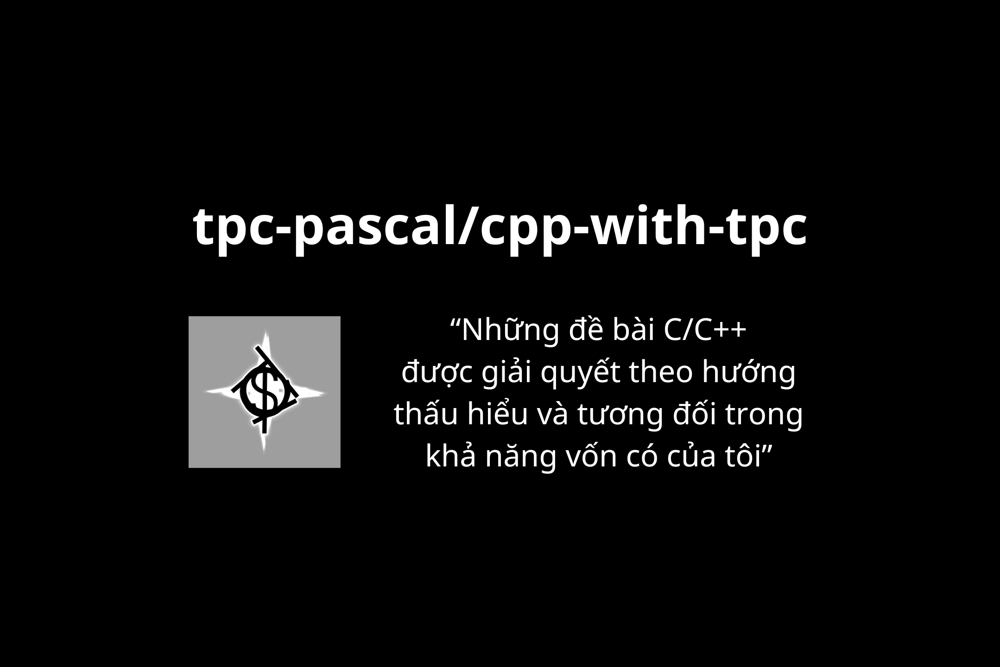

# cpp-with-tpc

Hành trình rèn luyện C++ mỗi ngày qua các bài toán cấu trúc dữ liệu và tối ưu thuật toán.

<p align="center">
  
</p>

<p align="center">

  
  
</p>

---

## 📖 Giới thiệu
Tôi yêu lập trình, và C++ là ngôn ngữ đồng hành cùng tôi trên con đường giải quyết những bài toán hóc búa. Repo này là nơi lưu trữ hành trình rèn luyện thuật toán mỗi ngày của tôi.

## 🛠 Thông tin kỹ thuật
* **Ngôn ngữ:** C++ (Standard C++17 trở lên).
* **Trình biên dịch khuyến nghị:** `GCC 9.0+` hoặc `Clang 10.0+`.
* **Cách biên dịch thủ công:**
    ```bash
    g++ -std=c++17 -O2 filename.cpp -o main
    ./main
    ```

## 📊 Thống kê giải bài (Tracking)
| Nguồn bài tập | Trạng thái | Ghi chú |
| :--- | :---: | :--- |
| [Luyen Code](https://luyencode.net) | 🟡 Đang thực hiện | Giải theo lộ trình cơ bản |
| [NTUCoder](https://thptchuyen.ntucoder.net) | 🟡 Đang thực hiện | Các bài tập HSG |
| [OJ-VNOI](https://oj.vnoi.info) | 🟡 Đang thực hiện | Các bài tập thuật toán nâng cao |
| [300 Exercise Code For Youth](https://drive.google.com/file/d/1pbDj3u8VYD3H0v-lSiFSNqFc43PBzds8/view?usp=sharing) | 🟡 Đang thực hiện | Luyện tư duy căn bản |

## 📝 Ghi chú quan trọng
* **Tính tối ưu:** Các solution tập trung vào ý tưởng giải quyết vấn đề tại thời điểm viết. Trong tương lai, tôi sẽ cập nhật các phiên bản tối ưu hơn về bộ nhớ và thời gian xử lý.
* **Tần suất:** Mục tiêu ít nhất 1 file `.cpp` mỗi ngày khi có thời gian rảnh.
* **Cơ chế vòng lặp (T):**
    * `T > 0`: Chạy chương trình `T` lần (số lượng test case).
    * `T < 0`: Chạy vô hạn cho đến khi nhận tín hiệu ngắt (`Ctrl+Z`, `Ctrl+C`).
* **Input:** Chương trình hoạt động tốt nhất khi dữ liệu nhập vào tuân thủ đúng định dạng và điều kiện của đề bài.

## 🤝 Đóng góp (Contributing)
Mọi ý đóng góp về các giải pháp tối ưu hơn luôn được chào đón. Bạn có thể:
1. Fork dự án.
2. Tạo Branch mới (`git checkout -b feature/Optimization`).
3. Commit thay đổi của bạn.
4. Push lên Branch và mở một **Pull Request**.

---
*Chúc bạn có những giờ phút coding vui vẻ!* 🚀
